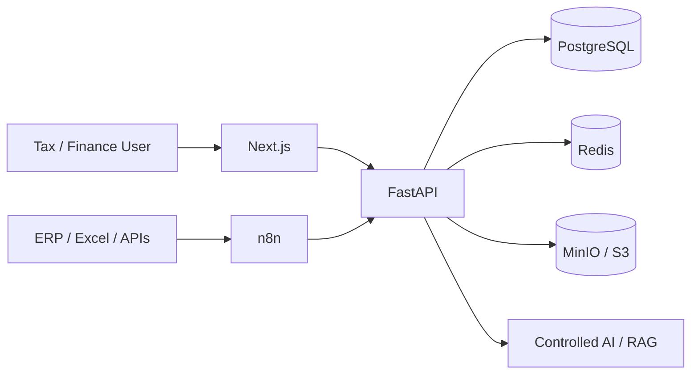

# Architecture

```mermaid
flowchart LR
  U[Tax / Finance User] --> FE[Next.js]
  FE --> API[FastAPI]
  API --> PG[(PostgreSQL)]
  API --> R[(Redis)]
  API --> S3[(MinIO / S3)]
  N8N[n8n] --> API
  ERP[ERP / Excel / APIs] --> N8N
  API --> AI[Controlled AI / RAG]
```

Authoritative financial calculations remain in deterministic backend services. n8n orchestrates schedules, integrations and workflow triggers.
