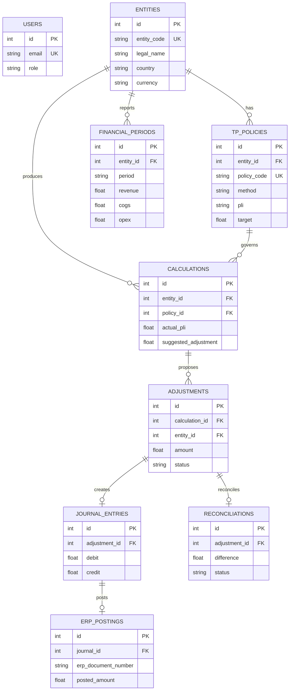

# Entity Relationship Diagram

```mermaid
erDiagram
  USERS {
    int id PK
    string email UK
    string role
  }
  ENTITIES {
    int id PK
    string entity_code UK
    string legal_name
    string country
    string currency
  }
  TP_POLICIES {
    int id PK
    int entity_id FK
    string policy_code UK
    string method
    string pli
    float target
  }
  FINANCIAL_PERIODS {
    int id PK
    int entity_id FK
    string period
    float revenue
    float cogs
    float opex
  }
  CALCULATIONS {
    int id PK
    int entity_id FK
    int policy_id FK
    float actual_pli
    float suggested_adjustment
  }
  ADJUSTMENTS {
    int id PK
    int calculation_id FK
    int entity_id FK
    float amount
    string status
  }
  JOURNAL_ENTRIES {
    int id PK
    int adjustment_id FK
    float debit
    float credit
  }
  ERP_POSTINGS {
    int id PK
    int journal_id FK
    string erp_document_number
    float posted_amount
  }
  RECONCILIATIONS {
    int id PK
    int adjustment_id FK
    float difference
    string status
  }
  ENTITIES ||--o{ TP_POLICIES : has
  ENTITIES ||--o{ FINANCIAL_PERIODS : reports
  ENTITIES ||--o{ CALCULATIONS : produces
  TP_POLICIES ||--o{ CALCULATIONS : governs
  CALCULATIONS ||--o{ ADJUSTMENTS : proposes
  ADJUSTMENTS ||--o| JOURNAL_ENTRIES : creates
  JOURNAL_ENTRIES ||--o| ERP_POSTINGS : posts
  ADJUSTMENTS ||--o| RECONCILIATIONS : reconciles
```
